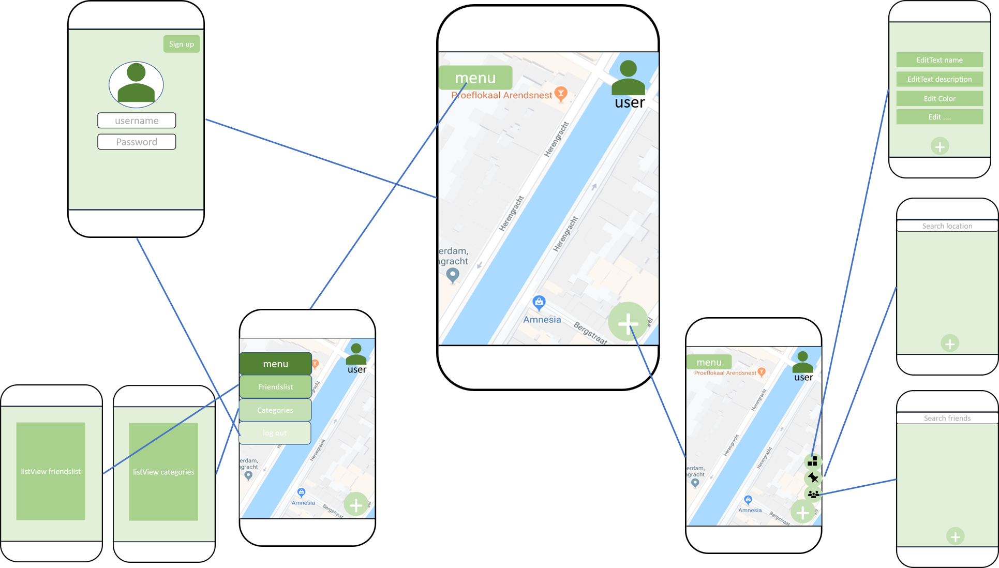

# Locationmapper

## Problem Statement

This project aims to make it possible to save locations and experiences and share them with
your friends. In some way it should become a hybrid of google maps and social media.
While google maps allows us to search locations very fast, and social media allows us 
to connect to people quite easily, attempts of a hybrid between the two are not succesfully
implemented (to my knowledge). This app is going to fill that gap. 

## google maps API

for the map information I found that google maps is emplemented in a lot of other apps, which
should be possible in my app as well. This site gave me some information about that:

https://developers.google.com/maps/documentation/android-sdk/intro?hl=nl

"With the Maps SDK for Android, you can add maps based on Google Maps data to your application. 
The API automatically handles access to Google Maps servers, data downloading, 
map display, and response to map gestures."

## Social media aspect 

Furthermore a socialmedia aspect should be incorporated in the app. This would require a secure way to safe information 
on a server or in a database, such as friendslists, locationlists, passwords, usernames etc. This could be done with postrequests
to an API just like in Trivia, but this does not seem to be one of the safest ways. On the other hand, an SQL table implemented in 
all the projects in Android Studio so far, could only be used to safe information locally, while it should be available from multiple
devices. This aspect would require some more thinking and tips are welcome. 

## design

The app should have an accessible design, making it 
as easy to handle for the user as possible. 

First draft of the design:

## main features

### login & signup screen

### mapview

### friendsmenu

### add/delete/update locations menu 

## prerequisites

1. I need to be able to work with the google maps API.

2. I need to find a reliable and secure way to store delicate information. 

Inspiration of the social media-side of the app can be acquired from facebook, instagram etc. 

### hardest parts

making the google maps API work properly. 

